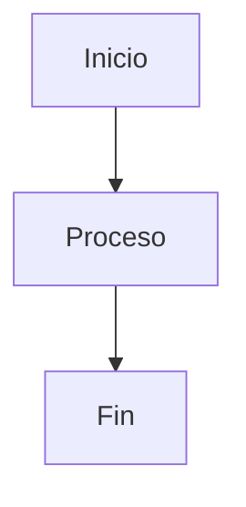

# 📘 GUÍA DEFINITIVA COMPLETA DE MARKDOWN (README.md)

Esta guía incluye absolutamente TODO lo que puedes usar en Markdown
compatible con GitHub Flavored Markdown (GFM).

---

# 📑 TABLA DE CONTENIDOS

1. Encabezados  
2. Texto y formato  
3. Listas  
4. Enlaces  
5. Imágenes  
6. Citas  
7. Código  
8. Tablas  
9. Líneas horizontales  
10. Checklist  
11. HTML en Markdown  
12. Detalles desplegables  
13. Badges  
14. Emojis  
15. Anclas internas  
16. Escapar caracteres  
17. Comentarios  
18. Saltos de línea  
19. Alertas GitHub  
20. Diagramas Mermaid  
21. Enlaces por referencia  
22. Notas al pie  

---

# 1️⃣ ENCABEZADOS

## Resultado

# H1
## H2
### H3
#### H4
##### H5
###### H6

## Sintaxis

```md
# H1
## H2
### H3
#### H4
##### H5
###### H6
```

---

# 2️⃣ TEXTO Y FORMATO

## Resultado

**Negrita**  
*Itálica*  
***Negrita + Itálica***  
~~Tachado~~  
<u>Subrayado (HTML)</u>

## Sintaxis

```md
**Negrita**
*Itálica*
***Negrita + Itálica***
~~Tachado~~
<u>Subrayado</u>
```

---

# 3️⃣ LISTAS

## Resultado

- Elemento 1
- Elemento 2
  - Sub elemento
    - Sub sub elemento

1. Paso uno
2. Paso dos
3. Paso tres

## Sintaxis

```md
- Elemento 1
- Elemento 2
  - Sub elemento
    - Sub sub elemento

1. Paso uno
2. Paso dos
3. Paso tres
```

---

# 4️⃣ ENLACES

## Resultado

[Google](https://www.google.com)  
https://github.com

## Sintaxis

```md
[Google](https://www.google.com)

https://github.com
```

---

# 5️⃣ IMÁGENES

## Resultado


## Sintaxis

```md

```

Imagen con enlace:

```md
[](https://google.com)
```

---

# 6️⃣ CITAS

## Resultado

> Esto es una cita  
>> Cita anidada

## Sintaxis

```md
> Esto es una cita
>> Cita anidada
```

---

# 7️⃣ CÓDIGO

## Código en línea

Resultado:

Usa `console.log()`.

Sintaxis:

```md
Usa `console.log()`.
```

## Bloque de código

Sintaxis:

```javascript
function hola() {
  console.log("Hola mundo");
}
```


---

# 8️⃣ TABLAS

## Resultado

| Izquierda | Centro | Derecha |
|:----------|:------:|--------:|
| Texto     | Texto  | Texto   |

## Sintaxis

```md
| Izquierda | Centro | Derecha |
|:----------|:------:|--------:|
| Texto     | Texto  | Texto   |
```

---

# 9️⃣ LÍNEAS HORIZONTALES

## Resultado

---

***

___

## Sintaxis

```md
---
***
___
```

---

# 🔟 CHECKLIST (GitHub)

## Resultado

- [x] Tarea completada
- [ ] Tarea pendiente

## Sintaxis

```md
- [x] Tarea completada
- [ ] Tarea pendiente
```

---

# 1️⃣1️⃣ HTML DENTRO DE MARKDOWN

## Resultado

<b>Texto en negrita con HTML</b>
<br>
<hr>

## Sintaxis

```html
<b>Texto en negrita con HTML</b>
<br>
<hr>
```

---

# 1️⃣2️⃣ DETALLES DESPLEGABLES (GitHub)

## Resultado

<details>
  <summary>Haz clic para expandir</summary>

  Contenido oculto aquí.

</details>

## Sintaxis

```html
<details>
  <summary>Haz clic para expandir</summary>

  Contenido oculto aquí.

</details>
```

---

# 1️⃣3️⃣ BADGES

## Resultado


## Sintaxis

```md

```

---

# 1️⃣4️⃣ EMOJIS

## Resultado

😄 🚀 🔥

## Sintaxis

```md
😄 🚀 🔥

:smile:
:rocket:
:fire:
```

---

# 1️⃣5️⃣ ANCLAS INTERNAS

## Resultado

[Ir a Tablas](#8️⃣-tablas)

## Sintaxis

```md
[Ir a Tablas](#8️⃣-tablas)
```

---

# 1️⃣6️⃣ ESCAPAR CARACTERES

## Resultado

\*Esto no será cursiva\*

## Sintaxis

```md
\*Esto no será cursiva\*
```

---

# 1️⃣7️⃣ COMENTARIOS OCULTOS

## Sintaxis

```md
<!-- Este comentario no se verá -->
```

---

# 1️⃣8️⃣ SALTOS DE LÍNEA

## Resultado

Línea uno  
Línea dos  

## Sintaxis

```md
Línea uno␠␠
Línea dos
```

(Usa dos espacios al final de la línea)

---

# 1️⃣9️⃣ ALERTAS GITHUB

## Resultado

> [!NOTE]
> Nota informativa

> [!WARNING]
> Advertencia importante

## Sintaxis

```md
> [!NOTE]
> Nota informativa

> [!WARNING]
> Advertencia importante
```

---

# 2️⃣0️⃣ DIAGRAMAS MERMAID

## Resultado



## Sintaxis

```md

```

---

# 2️⃣1️⃣ ENLACES POR REFERENCIA

## Resultado

[Google][1]

[1]: https://google.com

## Sintaxis

```md
[Google][1]

[1]: https://google.com
```

---

# 2️⃣2️⃣ NOTAS AL PIE

## Resultado

Texto con referencia[^1]

[^1]: Esto es una nota al pie.

## Sintaxis

```md
Texto con referencia[^1]

[^1]: Esto es una nota al pie.
```

---

